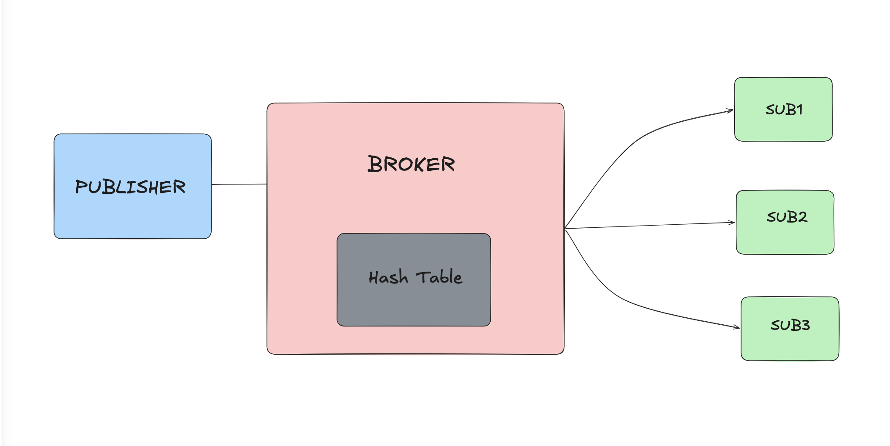

## muque

A real-time pub/sub message broker in Go.

Listens on TCP `:8080`. Clients send one JSON object per line:

{"command":"SUB","topic":"scores","payload":""}
{"command":"PUB","topic":"scores","payload":"wicket"}

